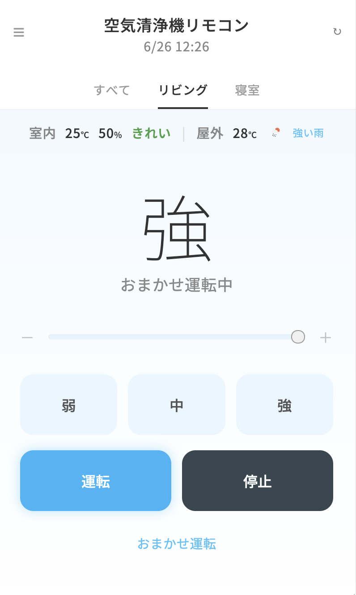

# 空気清浄機リモコン

Node-RED で作成した架空の空気清浄機リモコンアプリです。  
ECHONET Lite プロトコルを使って架空のデバイスを制御し、OpenWeather API で屋外の気象情報を取得します。

## 画面イメージ

![空気清浄機リモコン]

## 使用技術

- **Node-RED** — フロー制御・APIサーバー
- **ECHONET Lite** — 架空デバイスとの通信プロトコル
- **OpenWeather API** — 屋外気温・天気の取得
- **Gmail（IMAP）** — メール受信による遠隔操作
- **HTML / CSS / JavaScript** — リモコンUI

## 主な機能

- 運転 / 停止の切り替え
- 風量（弱 / 中 / 強）の調整
- スライダーによる風量操作
- おまかせ運転（湿度に応じて自動でON/OFF）
- メール送信による遠隔ON/OFF操作（「on」「運転」で起動、「off」「停止」で停止）
- 屋外の気温・天気をリアルタイム表示
- 60秒ごとに現在の状態を自動更新

## ファイル構成

```
air-cleaner-remote/
├── air_cleaner_remote.html  # リモコンUI（HTML/CSS/JavaScript）
├── flows.json               # Node-RED フロー定義
└── README.md
```

## 実行方法

1. Node-RED を起動する
    ```bash
    node-red
    ```
2. `flows.json` をNode-REDにインポートする  
   （メニュー → 読み込み → ファイルを選択）
3. デプロイする
4. ブラウザで `http://localhost:1880/airCleaner` にアクセスする
